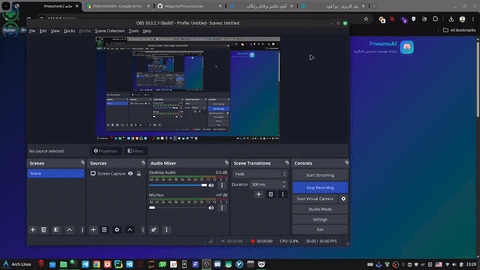
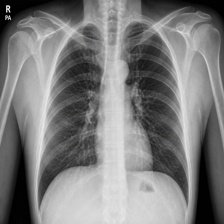
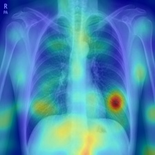
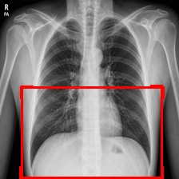

<div align="center">

# PneumoScan 🫁

### سامانه هوشمند تشخیص ذات‌الریه | AI-Powered Pneumonia Detection

[](https://python.org)
[](https://djangoproject.com)
[](https://tensorflow.org)
[](LICENSE)

<div dir="rtl">

<picture>

</picture>

</div>

</div>

---

### 🎬 Demo Video | ویدیو نمونه

<div align="center">



</div>

---

<div dir="rtl">

## 🇮🇷 فارسی

### معرفی

**PneumoScan** یک سامانه وب مبتنی بر یادگیری عمیق برای تشخیص خودکار ذات‌الریه از تصاویر رادیوگرافی قفسه سینه است. این سامانه از مدل **DenseNet121** با دقت **95.2%** استفاده می‌کند و قابلیت‌های زیر را ارائه می‌دهد:

- تشخیص ذات‌الریه با یک کلیک
- نقشه حرارتی (Grad-CAM) برای توضیح‌پذیری مدل
- باکس ناحیه تشخیص برای مشخص کردن ناحیه مشکوک
- داشبورد آماری با تاریخچه پیش‌بینی‌ها
- تنظیم آستانه حساسیت تشخیص

### تصاویر نمونه

<div align="center">
<table>
<tr>
<td align="center"><b>تصویر اصلی</b></td>
<td align="center"><b>نقشه حرارتی</b></td>
<td align="center"><b>ناحیه تشخیص</b></td>
</tr>
<tr>
<td></td>
<td></td>
<td></td>
</tr>
</table>
</div>

### معماری مدل

| ویژگی | مقدار |
|-------|-------|
| معماری | DenseNet121 |
| اندازه ورودی | 224×224×3 |
| دقت نهایی | 95.2% |
| دقت اعتبارسنجی | 93.8% |
| ROC-AUC | 98.3% |
| تعداد اپاک | 40 (2 مرحله) |
| بهینه‌ساز | AdamW |
| تابع هزینه | Binary Cross-Entropy |

### نصب و راه‌اندازی

```bash
# 1. کلون کردن پروژه
git clone https://github.com/Mtgama/PneumoScan.git
cd PneumoScan

# 2. ساخت محیط مجازی
python -m venv venv
source venv/bin/activate  # لینوکس/مک
# venv\Scripts\activate   # ویندوز

# 3. نصب وابستگی‌ها
pip install -r requirements.txt

# 4. اجرای مایگریشن‌ها
python manage.py migrate

# 5. اجرای سرور
python manage.py runserver
```

سایت روی `http://127.0.0.1:8000` اجرا می‌شود.

### دانلود وزن‌های مدل

فایل وزن‌های مدل آموزش‌دیده در ریپازیتوری قرار ندارد (به خاطر حجم بالا). آن را از لینک زیر دانلود کرده و در روت پروژه قرار دهید:

> **[دانلود مدل (bestmodelfinalhamine.keras)](https://s25.uupload.ir/files/matgama/%D9%BE%D9%86%D9%88%D9%85%D9%88%D9%86%DB%8C%20%D9%85%D8%AF%D9%84/pnumonia_project.zip)**

پس از دانلود و اکسترact کردن، فایل `bestmodelfinalhamine.keras` را در پوشه اصلی پروژه قرار دهید:

```
PneumoScan/
├── bestmodelfinalhamine.keras   ← اینجا قرار دهید
├── manage.py
├── ...
```

### ساختار پروژه

```
PneumoScan/
├── pneumoai_project/          # تنظیمات پروژه جنگو
│   ├── settings.py
│   ├── urls.py
│   └── wsgi.py
├── django_project/            # اپلیکیشن اصلی
│   ├── models.py              # مدل‌های دیتابیس
│   ├── views.py               # ویوها و API
│   ├── urls.py                # مسیرها
│   ├── inference.py           # کد استنتاج مدل
│   ├── apps.py                # تنظیمات اپلیکیشن
│   ├── templates/             # قالب‌های HTML
│   │   └── diagnosis/
│   │       ├── base.html
│   │       ├── home.html
│   │       ├── results.html
│   │       ├── dashboard.html
│   │       ├── metrics.html
│   │       └── training.html
│   └── static/                # فایل‌های استاتیک
│       └── diagnosis/
│           ├── css/main.css
│           └── js/
├── bestmodelfinalhamine.keras          # مدل آموزش‌دیده
├── bestmodelfinalhamine_compatible.keras # مدل سازگار با Keras 3
├── model.py                   # کد آموزش مدل
├── manage.py
└── requirements.txt
```

### API Endpoints

| مسیر | متد | توضیح |
|------|-----|-------|
| `/api/predict/` | POST | تشخیص از تصویر آپلود شده |
| `/api/predict-url/` | POST | تشخیص از URL تصویر |
| `/api/metrics/` | GET | معیارهای ارزیابی مدل |
| `/api/training-data/` | GET | تاریخچه آموزش |
| `/api/dashboard-stats/` | GET | آمار کلی داشبورد |
| `/api/history/` | GET | تاریخچه پیش‌بینی‌ها |
| `/api/daily-stats/` | GET | آمار روزانه |

### صفحات سایت

| صفحه | آدرس | توضیح |
|------|-------|-------|
| خانه | `/` | آپلود تصویر و تنظیم حساسیت |
| نتایج | `/results/` | تصاویر تحلیل + نمودارها |
| داشبورد | `/dashboard/` | آمار و تاریخچه |
| عملکرد مدل | `/metrics/` | نمودارهای ارزیابی |
| گزارش آموزش | `/training/` | روند آموزش مدل |

### تکنولوژی‌ها

- **بکند**: Django 4.2, Python 3.10+
- **مدل هوش مصنوعی**: TensorFlow/Keras, DenseNet121
- **فرانت‌اند**: HTML, CSS, JavaScript, Chart.js
- **دیتابیس**: SQLite (قابل تغییر به PostgreSQL)
- **پردازش تصویر**: Pillow, Matplotlib, SciPy

---

</div>

## 🇬🇧 English

### Introduction

**PneumoScan** is a deep learning-powered web application for automatic detection of pneumonia from chest X-ray images. It uses a **DenseNet121** model achieving **95.2% accuracy** with the following features:

- One-click pneumonia detection
- Grad-CAM heatmap for model explainability
- Bounding box highlighting the detected region
- Dashboard with prediction history and statistics
- Adjustable detection sensitivity threshold

### Sample Output

<div align="center">
<table>
<tr>
<td align="center"><b>Original</b></td>
<td align="center"><b>Heatmap</b></td>
<td align="center"><b>Bounding Box</b></td>
</tr>
<tr>
<td></td>
<td></td>
<td></td>
</tr>
</table>
</div>

### Model Architecture

| Feature | Value |
|---------|-------|
| Architecture | DenseNet121 |
| Input Size | 224×224×3 |
| Final Accuracy | 95.2% |
| Validation Accuracy | 93.8% |
| ROC-AUC | 98.3% |
| Epochs | 40 (2 stages) |
| Optimizer | AdamW |
| Loss Function | Binary Cross-Entropy |

### Installation

```bash
# 1. Clone the repository
git clone https://github.com/Mtgama/PneumoScan.git
cd PneumoScan

# 2. Create virtual environment
python -m venv venv
source venv/bin/activate  # Linux/Mac
# venv\Scripts\activate   # Windows

# 3. Install dependencies
pip install -r requirements.txt

# 4. Run migrations
python manage.py migrate

# 5. Start the server
python manage.py runserver
```

The site will be available at `http://127.0.0.1:8000`.

### Download Model Weights

The trained model weights are not included in the repository (due to file size). Download them from the link below and place them in the project root:

> **[Download Model (bestmodelfinalhamine.keras)](https://s25.uupload.ir/files/matgama/%D9%BE%D9%86%D9%88%D9%85%D9%88%D9%86%DB%8C%20%D9%85%D8%AF%D9%84/pnumonia_project.zip)**

After downloading and extracting, place `bestmodelfinalhamine.keras` in the project root:

```
PneumoScan/
├── bestmodelfinalhamine.keras   ← place here
├── manage.py
├── ...
```

### Project Structure

```
PneumoScan/
├── pneumoai_project/          # Django project config
│   ├── settings.py
│   ├── urls.py
│   └── wsgi.py
├── django_project/            # Main application
│   ├── models.py              # Database models
│   ├── views.py               # Views and API
│   ├── urls.py                # URL routing
│   ├── inference.py           # Model inference
│   ├── apps.py                # App config
│   ├── templates/             # HTML templates
│   └── static/                # Static files (CSS, JS)
├── bestmodelfinalhamine.keras          # Trained model
├── bestmodelfinalhamine_compatible.keras # Keras 3 compatible model
├── model.py                   # Training code
├── manage.py
└── requirements.txt
```

### API Endpoints

| Endpoint | Method | Description |
|----------|--------|-------------|
| `/api/predict/` | POST | Predict from uploaded image |
| `/api/predict-url/` | POST | Predict from image URL |
| `/api/metrics/` | GET | Model evaluation metrics |
| `/api/training-data/` | GET | Training history |
| `/api/dashboard-stats/` | GET | Dashboard statistics |
| `/api/history/` | GET | Prediction history |
| `/api/daily-stats/` | GET | Daily statistics |

### Pages

| Page | URL | Description |
|------|-----|-------------|
| Home | `/` | Upload image & adjust sensitivity |
| Results | `/results/` | Analysis images + charts |
| Dashboard | `/dashboard/` | Statistics & history |
| Model Metrics | `/metrics/` | Evaluation charts |
| Training Report | `/training/` | Training progress |

### Tech Stack

- **Backend**: Django 4.2, Python 3.10+
- **AI Model**: TensorFlow/Keras, DenseNet121
- **Frontend**: HTML, CSS, JavaScript, Chart.js
- **Database**: SQLite (switchable to PostgreSQL)
- **Image Processing**: Pillow, Matplotlib, SciPy

---

### License

[MIT](LICENSE)

### Citation

If you use this project in your research, please cite:

```bibtex
@software{pneumoscan2026,
  title={PneumoScan: AI-Powered Pneumonia Detection},
  year={2026},
  url={https://github.com/Mtgama/PneumoScan}
}
```
